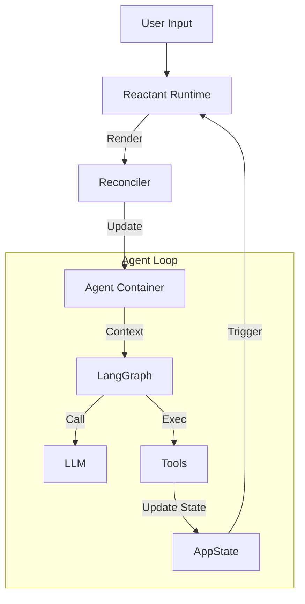

# ReActant

<p align="center">
  <strong>The "React" for AI Agents.</strong><br>
  Context Engineering Framework powered by React and LangGraph.
</p>

<p align="center">
  <a href="#introduction">Introduction</a> •
  <a href="#features">Features</a> •
  <a href="#installation">Installation</a> •
  <a href="#quick-start">Quick Start</a> •
  <a href="#core-concepts">Concepts</a> •
  <a href="#contributing">Contributing</a>
</p>

---

## Introduction

**ReActant** is a framework that brings the declarative power of React to the world of AI Agents. It treats **Agent Context** (Tools, Prompts, Memory) as a **UI View** that is a function of your application state.

Instead of managing complex imperative logic to decide *when* an agent should have *which* tools or *what* instructions, you simply write **React Components**.

```tsx
<Agent>
  <Instruction>You are a helpful assistant.</Instruction>
  
  {/* Logic is declarative and reactive */}
  {user.isAdmin && <Tool tool={adminPanel} />}
  
  <Complement instance={contextualDocs} />
</Agent>
```

When your app state changes, ReActant automatically "re-renders" the Agent's brain, ensuring the LLM always has the exact context it needs for the current moment.

## Features

- ⚛️ **Context as Code**: Define agent capabilities using JSX and Components.
- 🔄 **Reactive Runtime**: Automatic context synchronization. When your state updates (e.g. via Tool calls), the Agent's context refreshes instantly.
- 🧠 **Dynamic LangGraph**: Built on top of LangGraph, but the graph structure is managed dynamically by the React Tree.
- 💉 **Dependency Injection**: Inject state into your Agent and use conditional rendering (`when` props) for clean separation of concerns.
- 🛡️ **Type Safe**: First-class TypeScript support with Zod schema inference for Tools.

## Installation

```bash
npm install agent-reactant
# or
npm install react react-reconciler @langchain/langgraph @langchain/core @langchain/openai zod
```

*(Note: While in development, clone this repo and link locally)*

## Quick Start

### 1. Define your Agent

```tsx
import React from 'react';
import { Agent, Instruction, Tool, Reactant } from 'agent-reactant';
import { z, tool } from '@langchain/core/tools';

// Define a Tool
const searchTool = tool(async ({ query }) => "Search Results...", {
  name: "search",
  schema: z.object({ query: z.string() })
});

// Define the Agent Component
const MyAgent = ({ role }) => (
  <Agent>
    <Instruction>You are a helpful AI assistant.</Instruction>
    
    {role === 'researcher' && (
      <>
        <Instruction>Focus on gathering detailed information.</Instruction>
        <Tool tool={searchTool} />
      </>
    )}
  </Agent>
);
```

### 2. Run the App

```tsx
import { ChatOpenAI } from '@langchain/openai';

async function main() {
  // Initialize Framework
  const app = new Reactant({
    llm: new ChatOpenAI({ modelName: "gpt-4" })
  });

  // Render Agent with Initial State
  await app.render(<MyAgent role="researcher" />);

  // Chat
  const response = await app.chat("Find me the latest news on AI.");
  console.log(response.content);
}

main();
```

## Core Concepts

### 1. The "Cognitive DOM"
ReActant implements a custom React Renderer. Instead of rendering to HTML DOM, it renders to an **Agent Container**.
- `<Instruction>` -> System Prompt
- `<Tool>` -> Bound Function
- `<Complement>` -> Dynamic Context Injection

### 2. Automatic Context Sync
When an Agent executes a Tool that modifies your application state, ReActant detects this and triggers a "re-render". The Agent immediately sees the updated context (e.g., new tools available, updated prompts) within the **same conversation turn**.

### 3. Patterns

#### JSX Composition
Pass logic objects as props to keep your JSX clean.

```tsx
<Agent>
  <Complement instance={missingInfoPrompt} />
  <Tool tool={myTool} />
</Agent>
```

#### Dependency Injection (DI)
Inject state globally and use `when` predicates.

```tsx
// In Component
<Tool 
  tool={refundTool} 
  when={(ctx) => ctx.user.role === 'admin'} 
/>

// In Runtime
app.render(<MyAgent />, { user: { role: 'admin' } });
```

## Architecture



## License

Distributed under the MIT License. See `LICENSE` for more information.
